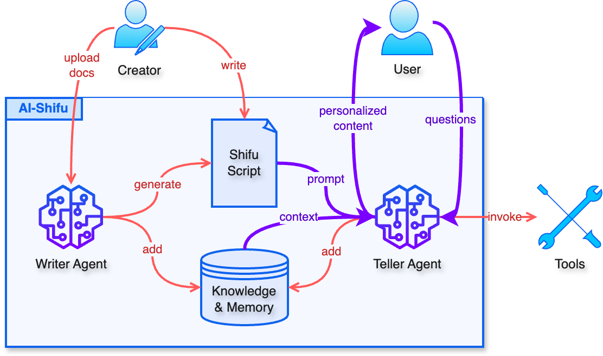

<div align="center">
  </img>
<p><strong>你看到的一切，都是量身定制的</strong></p>

[English](README.md) | 简体中文

</div>

AI 师傅是一个老师，一个主播，一个说书人，一个向导……做为一名 AI 驱动的讲述者，AI 师傅可以将任何文字内容用全个性化的方式呈现给每一位个体用户，创造前所未有的阅读体验。

<div align="center">
  
</div>

# 功能特性

1. **个性化输出**：根据用户的身份背景、兴趣偏好等，全方位个性化输出内容，媲美真人一对一的效果。
2. **媒体类型**：支持 Markdown、HTML、Mermaid 等多种格式的内容。
3. **内容安全**：预设的师傅剧本控制所有输出，降低幻觉。
4. **追问**：用户可以随时提问，获得上下文相关的智能回答。
5. **互动**：随时向用户提问，基于用户的回答推动后续进程。
6. **剧本编辑器**：方便地编辑剧本，预览效果。

# 开发计划

- [ ] 写作智能体，快速生成、维护剧本
- [ ] 知识库
- [ ] 语音输入输出

# 使用 AI 师傅

## 平台

[AI-Shifu.com](https://ai-shifu.com) 是一个由 AI 师傅开源项目驱动的教育平台。可以在上面学习各种 AI 课程。

## 自建站

请先确认你的机器已经安装好[Docker](https://docs.docker.com/get-docker/)和[Docker Compose](https://docs.docker.com/compose/install/)。

### 使用 Docker Hub 镜像

```bash
git clone https://github.com/ai-shifu/ai-shifu.git
cd ai-shifu/docker
cp .env.example .env
# 修改 .env 文件中的配置。至少要配置好一个大模型的参数，并将 DEFAULT_LLM_MODEL 设置为该模型的名称
docker compose up -d
```

### 从源代码构建

```bash
git clone https://github.com/ai-shifu/ai-shifu.git
cd ai-shifu/docker
cp .env.example .env
# 修改 .env 文件中的配置。至少要配置好一个大模型的参数，并将 DEFAULT_LLM_MODEL 设置为该模型的名称
./dev_in_docker.sh
```

### 访问

Docker 启动后：
1. 用浏览器打开 `http://localhost:8080`，访问用户界面
2. 用浏览器打开 `http://localhost:8081`，访问剧本编辑器
3. 登录时使用任意手机号，默认万能验证码为 1024