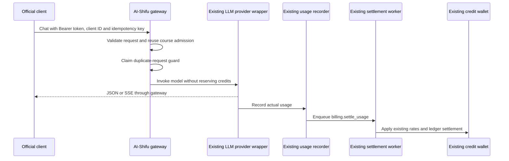

## Context

AI-Shifu already owns browser sign-in, device authorization, LLM provider
routing, usage metering, and credit billing. Official clients reuse these
capabilities through one account-backed model gateway.

Gateway calls follow the same billing lifecycle as course learning:
admission, provider invocation, usage recording, and asynchronous settlement.
Credit preauthorization is deliberately deferred to a future unified design
covering course learning and client calls together.

## Goals and boundaries

- Reuse existing device authorization and Bearer session tokens.
- Expose account credits, rated models, and OpenAI-compatible JSON/SSE chat.
- Charge the signed-in account through the existing settlement worker.
- Preserve existing course ownership, admission, recorder, and wallet rules.
- Add no tables, columns, indexes, migrations, wallet-owner abstraction, or
  application CLI to this repository.
- Keep third-party OAuth/OIDC registration and stronger client authentication
  outside this first version.

## Public surface

| Method | Path | Purpose |
| --- | --- | --- |
| `POST` | `/api/user/device/authorize` | Existing device authorization. |
| `POST` | `/api/user/device/token` | Existing authorization polling and session token. |
| `GET` | `/api/gateway/account` | User, available/reserved wallet credits, and billing URL. |
| `GET` | `/api/gateway/v1/models` | Rated model list and eligible default alias. |
| `POST` | `/api/gateway/v1/chat/completions` | OpenAI-compatible JSON or SSE output. |

Gateway user authentication accepts only `Authorization: Bearer <token>`.
Model-list and chat requests additionally require `X-AI-Shifu-Client-ID`,
matched exactly against `MODEL_GATEWAY_CLIENT_ALLOWLIST`; the empty default
denies all clients. Client IDs are caller-declared admission labels, not
secrets or proof of application identity, and are not bound to session tokens.
Device authorization and account reads do not require a client ID.

TLS must terminate at the trusted public edge. Direct backend access must be
restricted appropriately, and clients must use HTTPS except for loopback
development. A Flask HTTP request can be the internal hop of an HTTPS request.

## Runtime flow

## Admission and model eligibility

The gateway calls `admit_creator_usage` with the authenticated user ID, reusing
the same billing-enabled switch, consumable-bucket rules, and subscription
eligibility as course learning. It does not estimate or reserve the request's
maximum credit cost. With billing enabled, positive eligible credits admit a
request even when the maximum output allowance would cost more than that balance.

Models must be configured and have complete active input/cache/output rates,
using the existing charge resolver. Only eligible models are advertised.
`ai-shifu-default` resolves to the eligible configured default model.

Chat bodies are limited to 1 MiB, messages to 256, and tools to 128 before
tokenization. `stream` must be a JSON boolean when supplied. `max_tokens`
still respects the model's limit; it is not a credit reservation.

## Usage ownership and settlement

The gateway uses the unchanged shared `record_llm_usage` defaults. Successful
billable records enqueue the existing `billing.settle_usage` task; no synchronous
capture/release path or asynchronous-settlement suppression remains.

Course usage continues to resolve its billing account from `shifu_bid`.
Gateway usage has no course ID, so the server stamps
`extra.billing_source = "model_gateway"` on production LLM usage. Only that
marked, course-less record resolves to its authenticated `user_bid`. The
client cannot supply the marker or override the billed user. Existing course
ownership takes precedence, and debug ownership remains unchanged.

The existing worker owns rates, wallet/bucket mutation, ledger idempotency,
and replay/backfill. Responses can finish before the worker updates the wallet,
so clients must refresh balances and tolerate settlement delay. Gateway calls
create no hold or release entries; `reserved_credits` can still reflect other
existing operations such as voice cloning.

Missing provider usage is estimated from generated assistant/reasoning text and
tool function names/arguments, not protocol JSON. Failed or interrupted calls,
including partial failed streams, are marked non-billable and use the shared
failed-usage skip rules rather than a gateway-only partial-charge policy.

## Duplicate-request protection

Every logical chat request still requires an `Idempotency-Key` of 1 to 90
characters. A deterministic 36-character request ID is derived from the account
and key. Before invocation, the gateway checks the existing indexed usage
request ID and atomically claims a shared cache key with a 24-hour TTL.

Concurrent/repeated keys return HTTP 409 without another model call. Recorded
usage continues to reject replay after the cache entry expires, for as long as
that usage record is retained. A request that fails before usage is persisted
is protected by the cache window only. Clients must never reuse logical keys,
and this version does not replay response bodies.

Production replicas must share the same reliable Redis backend. If the guard
cannot be checked or claimed, the gateway returns HTTP 503 rather than invoking
the provider. The guard is independent of credits and creates no billing ledger
entries. Cache loss during an unrecorded in-flight call remains a limitation.

## Error contract

| Status | Meaning |
| --- | --- |
| `400` | Invalid payload, client ID missing, or model/rates unavailable. |
| `401` | Missing, invalid, expired, or revoked session token. |
| `402` | No eligible credits or wallet at admission; includes billing URL. |
| `403` | Client ID is not allowlisted. |
| `409` | Duplicate logical request. |
| `413` | Request body exceeds 1 MiB. |
| `503` | Request guard unavailable. |
| `502` | Provider invocation failed. |

Public messages use the shared language catalog; statuses and machine codes
remain stable. Admission errors follow the existing course policy.

## Consistency limits

A balance check is not a reservation. Concurrent requests can pass admission
before earlier usage is settled. If the existing worker later reports
insufficient credits, it does not partially debit the wallet; the usage remains
available for existing replay/backfill workflows. This is the same tradeoff as
course learning, not a guaranteed prevention of overspending.

Usage persistence and settlement enqueue retain the existing best-effort
behavior. Worker availability, monitoring, and replay are operational
requirements. A future preauthorization/recovery design should cover all
billing paths together rather than introduce a separate gateway mechanism.

## Verification

Tests cover no credit mutation during admission/provider execution, one queued
usage record, delayed charging of the signed-in account by the existing worker,
repeated settlement, independent request deduplication, failed-call behavior,
course ownership precedence, input limits, localization, and JSON/SSE contracts.
The legacy reservation service and shared usage recorder match the PR base.

See [Model Gateway CLI Integration](../references/model-gateway-cli-integration.md)
for the external client contract.
