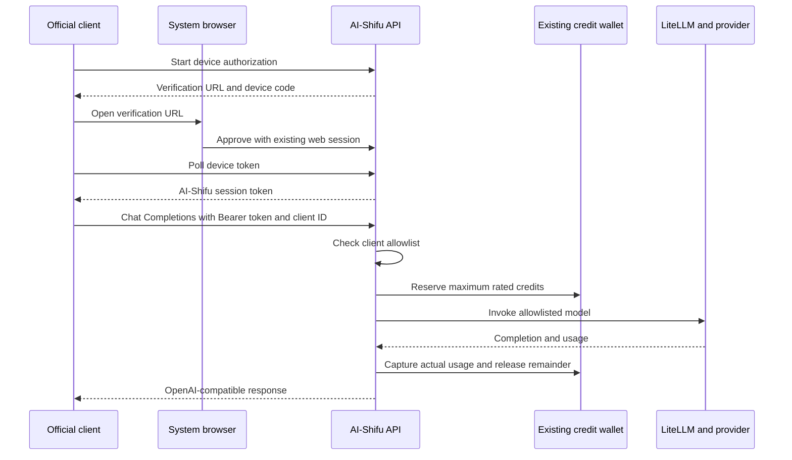

## Context

AI-Shifu already owns browser sign-in, device authorization for the Course
CLI, model provider routing through LiteLLM, user credit wallets, usage
metering, and the credit ledger. Official native clients need a small public
surface that combines those existing capabilities without introducing a
second account system, wallet, or provider credential store.

The first version deliberately reuses the current device authorization token.
It does not implement OAuth/OIDC client registration or scoped access tokens.
That keeps the Course CLI compatible and avoids database migrations, but the
token retains the broad authority of an AI-Shifu sign-in session. This version
is therefore an official-client integration surface, not a third-party
developer platform.

## Goals

- Let an official client sign in through the existing browser device flow.
- Let signed-in users of allowlisted clients with an existing credit wallet
  call rated AI-Shifu models, whether or not the user is marked as a teacher.
- Expose OpenAI-compatible model listing and Chat Completions contracts.
- Reserve credits before provider work, capture actual rated usage, and release
  the unused reservation in the same transaction.
- Preserve the existing database schema and asynchronous settlement behavior
  used by learning flows.
- Keep provider credentials and internal provider errors on the server.

## Non-goals

- Third-party clients, dynamic client registration, scopes, OIDC discovery, or
  dedicated access and refresh tokens.
- A full application CLI inside this repository.
- Responses API, embeddings, multimodal input, audio, files, or ledger browsing.
- Renaming `creator_bid` or introducing a wallet-owner abstraction.
- Creating a wallet automatically when the signed-in user has none.

## Public surface

| Method | Path | Response contract |
| --- | --- | --- |
| `POST` | `/api/user/device/authorize` | Existing common response envelope with device and verification codes. |
| `POST` | `/api/user/device/token` | Existing common response envelope with pending, denied, or approved status and the session token. |
| `GET` | `/api/gateway/account` | Common response envelope with identity, available and reserved credits, and the billing URL. |
| `GET` | `/api/gateway/v1/models` | OpenAI-compatible model list. |
| `POST` | `/api/gateway/v1/chat/completions` | OpenAI-compatible JSON or SSE response. |

Gateway user authentication accepts only `Authorization: Bearer <token>`. Existing Cook Web
and Course CLI routes keep their current cookie and `Token` header behavior.

Model listing and Chat Completions additionally require
`X-AI-Shifu-Client-ID`, checked against the comma-separated environment setting
`MODEL_GATEWAY_CLIENT_ALLOWLIST`. The default empty list denies every client.
IDs match exactly and case-sensitively, with no wildcard matching. Device
authorization and the account endpoint keep their existing behavior.

Chat requests require `Idempotency-Key`. The key is used as the existing
operation identifier, so the ledger's current `(creator_bid, idempotency_key)`
uniqueness prevents a repeated request from reserving or charging twice.

## Runtime flow

## Authentication boundary

The gateway parses the Bearer header itself and calls the existing
`validate_user` helper. Gateway routes bypass the legacy global request-token
extractor only because that extractor does not read the standard Authorization
header. Token validation, sliding expiry, user lookup, and session revocation
remain owned by the existing user service.

After user authentication, model endpoints check the client ID before model
lookup, credit reservation, or provider invocation. The ID is supplied only in
the request header and is not forwarded to model providers. This admission
filter does not authenticate the application: allowed IDs can be copied by
other holders of valid user tokens, and tokens are not bound to client IDs.
No shared client secret or client-registration table is introduced.

The account and inference paths do not check `is_creator`. They query the
existing wallet with `CreditWallet.creator_bid == user.user_id`. A missing
wallet and an insufficient balance both stop before provider invocation.

## Model admission

`/v1/models` starts from `get_current_models` and retains only models that:

- are available through a configured LiteLLM provider;
- pass the existing recommended-model allowlist;
- have displayable credit multiplier metadata; and
- have active production rates for input, cache, and output tokens.

When the configured default model meets those requirements, the list also
contains `ai-shifu-default`. The alias is resolved to the rated default before
reservation and provider invocation.

## Credit consistency

Before provider work, the gateway counts the prompt with the configured model
tokenizer and resolves `max_tokens`. An omitted value defaults to the smaller
of 4096 and the model limit. The reservation assumes all input is uncached and
the entire output allowance is consumed.

After completion, the gateway records one existing `BillUsageRecord` with a
caller-selected `usage_bid` and disables the normal asynchronous settlement
enqueue. It then builds charges from actual input, cache, and output usage and
captures that amount from the reservation. Any unused amount returns to the
same wallet buckets in the capture transaction.

If the provider omits usage, the wrapper estimates output tokens locally and
marks the usage metadata as estimated. If no positive charge can be derived,
the conservative reservation is captured. A provider failure before a
non-streaming response or before any stream output releases the full hold.
Closing a streaming HTTP response before its iterator starts also releases the
hold through the response close callback.

No new tables, columns, indexes, or migrations are required. Gateway details
are stored only in the existing usage and ledger metadata JSON columns.

## Error contract

Gateway endpoints use real HTTP status codes and an OpenAI-shaped error body,
independent from the legacy HTTP-200 business error envelope.

| Status | Code | Meaning |
| --- | --- | --- |
| `400` | `invalid_request` or a field-specific code | Invalid payload or unavailable model. |
| `400` | `missing_client_id` | Missing or blank client ID header on a model endpoint. |
| `401` | `invalid_token` | Missing, invalid, expired, or revoked token. |
| `402` | `insufficient_credits` | Wallet missing or insufficient; includes `billing_url`. |
| `403` | `client_not_allowed` | Client ID is not explicitly allowlisted; no model or credit work is performed. |
| `409` | `idempotency_conflict` | The key has already been used. |
| `502` | `provider_error` | Provider invocation failed; internal details are suppressed. |

## Operational boundary

The gateway lives in the existing Flask deployment so reservation, wallet
bucket mutation, usage persistence, and ledger capture share the current
transaction and operational environment. A separate gateway service would
require remote token validation and distributed credit consistency, which is
not justified for the official-client rollout.

The architecture should be revisited before partner or third-party access.
That milestone requires client registration, exact redirect validation,
scopes, dedicated access and refresh tokens, and standard OAuth/OIDC metadata.

## Verification

- Route tests cover Bearer authentication, account/model shapes, JSON and SSE
  chat responses, and HTTP 402 mapping.
- Client admission tests cover missing and blank IDs, unknown and partially
  matching IDs, case sensitivity, empty configuration, and rejection before
  model lookup or credit work for JSON and SSE requests.
- Runtime tests cover validation, conservative reservation, idempotency
  conflict, provider-failure release, and tool-call output detection.
- Billing tests cover complete LLM rates, metered capture, and atomic partial
  capture/release across wallet buckets.
- LLM tests cover token limits, non-stream usage, streamed tool calls, and
  suppression of the normal asynchronous settlement enqueue.
- Existing device authorization tests remain the compatibility gate for the
  Course CLI login flow.

See [Model Gateway CLI Integration](../references/model-gateway-cli-integration.md)
for the client implementation contract.
